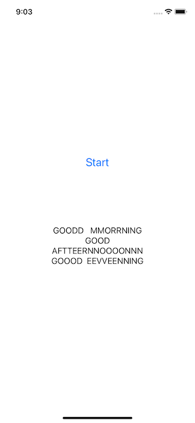
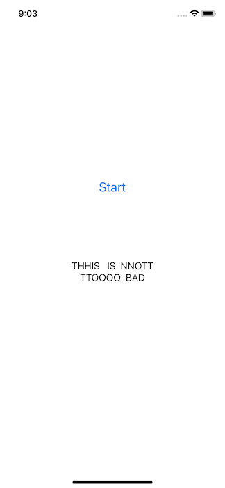
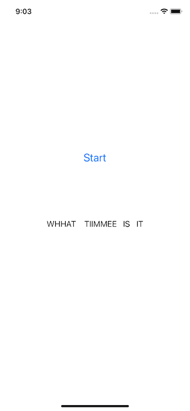

# Speech Recognition on iOS with Wav2Vec2

## Introduction

The model is based on a model provided by [PyTorch](https://github.com/pytorch/ios-demo-app)

Facebook AI's [wav2vec 2.0](https://github.com/pytorch/fairseq/tree/master/examples/wav2vec) is one of the leading models in speech recognition. It is also available in the [Hugging Face Transformers](https://github.com/huggingface/transformers) library, which is also used in another PyTorch iOS demo app for [Question Answering](https://github.com/pytorch/ios-demo-app/tree/master/QuestionAnswering).


## Prerequisites

* PyTorch 1.10 and torchaudio 0.10 (Optional)
* Python 3.8 or above (Optional)
* iOS Cocoapods LibTorch-Lite 1.10.0
* Xcode 12.4 or later

## Quick Start

### 1. Get the Repo


### 2. Prepare the Model

To install PyTorch 1.10, torchaudio 0.10 and the Hugging Face transformers, you can do something like this:

```
conda create -n wav2vec2 python=3.8.5
conda activate wav2vec2
pip install torch torchaudio
pip install transformers
```

Now with PyTorch 1.10 and torchaudio 0.10 installed, run the following commands on a Terminal:

```
python create_wav2vec2.py
```

This will create the model file `wav2vec2.ptl` and save to the `SpeechRecognition` folder.

If you don't have PyTorch 1.10 and torchaudio 0.10 installed or want to have a quick try of the demo app, you can download the quantized scripted wav2vec2 model file [here](https://pytorch-mobile-demo-apps.s3.us-east-2.amazonaws.com/wav2vec2.ptl), then drag and drop to the project, and continue to Step 3.

### 2. Use LibTorch

Run the commands below:

```
pod install
open SpeechRecognition.xcworkspace/
```

### 3. Build and run with Xcode

After the app runs, tap the Start button and start saying something; the model will continuously infer to recognize your speech by collecting audio every 6 seconds (until you hit the stop button), Some example results are as follows:





The data collected can be saved and read as JSON, CSV, or SQLite.
